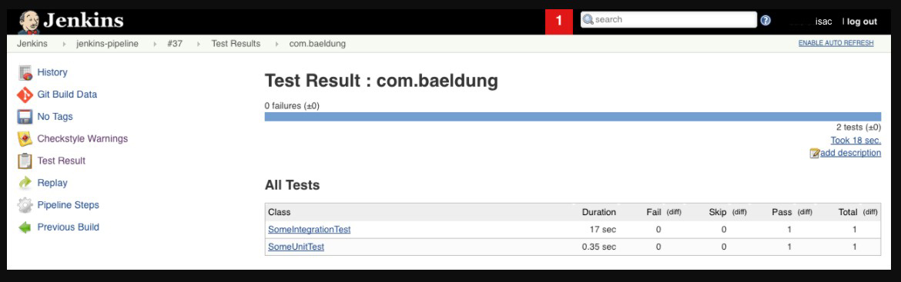

## Spring Jenkins

This module contains articles about Spring with Jenkins

### Relevant articles

- [Intro to Jenkins 2 and the Power of Pipelines](https://github.com/isaccanedo/jenkins-pipelines)

## Basic CRUD API with Spring Boot

This is the code of a simple API for some CRUD operations build using Spring Boot.

### Requirements

- Maven
- JDK 8
- MongoDB

### Running
To build and start the server simply type

```bash
$ mvn clean install
$ mvn spring-boot:run -Dserver.port=8989
```

Now with default configurations it will be available at: [http://localhost:8080](http://localhost:8080)

Enjoy it :)

# 1. Visão Geral
Neste artigo, vamos mostrar o uso de pipelines por meio de um exemplo de entrega contínua usando Jenkins.

Vamos construir um pipeline simples, mas bastante útil, para nosso projeto de amostra:

- Compilação;
- Análise estática simples (paralela à compilação);
- Testes unitários;
- Testes de integração (paralelo com testes unitários);
- Desdobramento, desenvolvimento.

# 2. Configurando o Jenkins
Em primeiro lugar, precisamos baixar a versão estável mais recente do Jenkins (2.73.3 no momento da redação deste artigo).

Vamos navegar até a pasta onde está nosso arquivo e executá-lo usando o comando java -jar jenkins.war. Lembre-se de que não podemos usar o Jenkins sem uma configuração inicial do usuário.

Depois de desbloquear o Jenkins usando a senha inicial gerada pelo administrador, devemos preencher as informações de perfil do primeiro usuário administrador e ter certeza de instalar todos os plug-ins recomendados.

Agora temos uma nova instalação do Jenkins pronta para ser usada.

Todas as versões disponíveis do Jenkins podem ser encontradas no link abaixo:
http://mirrors.jenkins.io/war-stable/2.73.1/

# 3. Pipelines
Jenkins 2 vem com um ótimo recurso chamado Pipelines, que é muito extensível quando precisamos definir um ambiente de integração contínua para um projeto.

Um Pipeline é outra maneira de definir algumas etapas do Jenkins usando código e automatizar o processo de implantação de software.

Ele está usando uma linguagem específica de domínio (DSL) com duas sintaxes diferentes:

- Pipeline declarativo;
- Pipeline com script.

Em nossos exemplos, usaremos o Scripted Pipeline que segue um modelo de programação mais imperativo construído com Groovy.

Vamos examinar algumas características do plug-in Pipeline:

- Os pipelines são gravados em um arquivo de texto e tratados como código; isso significa que eles podem ser adicionados ao controle de versão e modificados posteriormente;
- Eles permanecerão após reinicializações do servidor Jenkins;
- podemos opcionalmente pausar pipelines;
- Suportam requisitos complexos, como a execução de trabalhos em paralelo;
- O plugin Pipeline também pode ser estendido ou integrado com outros plugins.

Em outras palavras, configurar um projeto Pipeline significa escrever um script que aplicará sequencialmente algumas etapas do processo que desejamos realizar.

Para começar a usar pipelines temos que instalar o plugin Pipeline que permite compor automações simples e complexas.

Opcionalmente, podemos ter o Pipeline Stage View também para que, quando executarmos um build, vejamos todos os estágios que configuramos.

# 4. Um exemplo rápido
Para nosso exemplo, usaremos um pequeno aplicativo Spring Boot. Em seguida, criaremos um pipeline que clona o projeto, o constrói e executa vários testes e, em seguida, executa o aplicativo.

Vamos instalar os plug-ins Checkstyle, Static Analysis Collector e JUnit, que são respectivamente úteis para coletar os resultados do Checkstyle, construir um gráfico de análise combinado dos relatórios de teste e ilustrar os testes executados com sucesso e os que falharam.

Primeiro, vamos entender o motivo do Checkstyle aqui: é uma ferramenta de desenvolvimento que ajuda os programadores a escrever melhor código Java seguindo padrões aceitos e bem conhecidos.

Static Analysis Collector é um add-on que coleta diferentes saídas de análise e imprime os resultados em um gráfico de tendência combinado. Além disso, o plug-in fornece relatórios de funcionamento e estabilidade de construção com base nesses resultados agrupados.

Por fim, o plug-in JUnit fornece um editor que consome relatórios de teste XML gerados durante as compilações e fornece informações detalhadas e significativas relativas aos testes de um projeto.

Também configuraremos Checkstyle no pom.xml de nosso aplicativo:

```
<plugin>
    <groupId>org.apache.maven.plugins</groupId>
    <artifactId>maven-checkstyle-plugin</artifactId>
    <version>2.17</version>
</plugin>
```

# 5. Criação de um script de pipeline
Primeiro, precisamos criar um novo trabalho do Jenkins. Vamos nos certificar de selecionar Pipeline como o tipo antes de clicar no botão OK, conforme descrito nesta captura de tela:


A próxima tela nos permite preencher mais detalhes das diferentes etapas de nosso trabalho no Jenkins, como a descrição, gatilhos, algumas opções avançadas de projeto:


Vamos mergulhar na parte principal e mais importante desse tipo de trabalho clicando na guia Pipeline.

Em seguida, para a definição, selecione Pipeline script e marque Usar Groovy Sandbox.

Aqui está o script de trabalho para um ambiente Unix:

```
node {
    stage 'Clone the project'
    git 'https://github.com/eugenp/tutorials.git'
  
    dir('spring-jenkins-pipeline') {
        stage("Compilation and Analysis") {
            parallel 'Compilation': {
                sh "./mvnw clean install -DskipTests"
            }, 'Static Analysis': {
                stage("Checkstyle") {
                    sh "./mvnw checkstyle:checkstyle"
                    
                    step([$class: 'CheckStylePublisher',
                      canRunOnFailed: true,
                      defaultEncoding: '',
                      healthy: '100',
                      pattern: '**/target/checkstyle-result.xml',
                      unHealthy: '90',
                      useStableBuildAsReference: true
                    ])
                }
            }
        }
        
        stage("Tests and Deployment") {
            parallel 'Unit tests': {
                stage("Runing unit tests") {
                    try {
                        sh "./mvnw test -Punit"
                    } catch(err) {
                        step([$class: 'JUnitResultArchiver', testResults: 
                          '**/target/surefire-reports/TEST-*UnitTest.xml'])
                        throw err
                    }
                   step([$class: 'JUnitResultArchiver', testResults: 
                     '**/target/surefire-reports/TEST-*UnitTest.xml'])
                }
            }, 'Integration tests': {
                stage("Runing integration tests") {
                    try {
                        sh "./mvnw test -Pintegration"
                    } catch(err) {
                        step([$class: 'JUnitResultArchiver', testResults: 
                          '**/target/surefire-reports/TEST-' 
                            + '*IntegrationTest.xml'])
                        throw err
                    }
                    step([$class: 'JUnitResultArchiver', testResults: 
                      '**/target/surefire-reports/TEST-' 
                        + '*IntegrationTest.xml'])
                }
            }
            
            stage("Staging") {
                sh "pid=\$(lsof -i:8989 -t); kill -TERM \$pid " 
                  + "|| kill -KILL \$pid"
                withEnv(['JENKINS_NODE_COOKIE=dontkill']) {
                    sh 'nohup ./mvnw spring-boot:run -Dserver.port=8989 &'
                }   
            }
        }
    }
}
```

Primeiro, estamos clonando o repositório do GitHub e, em seguida, alterando o diretório para o nosso projeto, que é chamado spring-jenkins-pipeline.

Em seguida, compilamos o projeto e aplicamos a análise de Checkstyle de forma paralela.

A etapa a seguir representa uma execução paralela de testes de unidade e testes de integração e, em seguida, a implantação do aplicativo.

O paralelismo é usado para otimizar o pipeline e fazer com que o trabalho seja executado com mais rapidez. É uma prática recomendada no Jenkins executar simultaneamente algumas ações independentes que podem levar muito tempo.

Por exemplo, em um projeto do mundo real, geralmente temos muitos testes de unidade e integração que podem levar mais tempo.

Observe que se algum teste falhar, o BUILD será marcado como FALHA também e a implantação não ocorrerá.

Além disso, estamos usando JENKINS_NODE_COOKIE para evitar o desligamento imediato de nosso aplicativo quando o pipeline chega ao fim.

Para ver um script mais geral funcionando em outros sistemas diferentes, verifique o repositório GitHub.

# 6. Relatório de Análise
Depois de criar o trabalho, salvaremos nosso script e clicaremos em Build Now na página inicial do projeto de nosso painel do Jenkins.

Esta é uma visão geral das compilações:


Um pouco mais abaixo, encontraremos a visualização do estágio do pipeline, com o resultado de cada estágio:


Cada saída é acessível ao passar o mouse sobre uma célula de estágio e clicar no botão Logs para ver as mensagens de log impressas nessa etapa.

Também podemos encontrar mais detalhes da análise de código. Vamos clicar no build desejado no Build History no menu à direita e clicar em Checkstyle Warnings.

Aqui, vemos 60 avisos de alta prioridade navegáveis clicando em:


A guia Detalhes exibe informações que destacam os avisos e permitem que o desenvolvedor entenda as causas por trás deles.

Da mesma forma, o relatório de teste completo pode ser acessado clicando no link Resultado do Teste. Vamos ver os resultados do pacote com.isaccanedo:



Aqui podemos ver cada arquivo de teste com sua duração e status.

# 7. Conclusão
Neste artigo, configuramos um ambiente de entrega contínua simples para executar e mostrar análise de código estático e relatório de teste no Jenkins por meio de um trabalho Pipeline.